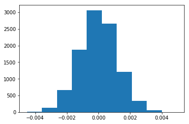

## Analyze A/B Test Results

This project will assure that the subjects covered in the statistics lessons are mastered. The hope is to have this project be as comprehensive of these topics as possible.

## Table of Contents
- [Introduction](#intro)
- [Part I - Probability](#probability)
- [Part II - A/B Test](#ab_test)
- [Part III - Regression](#regression)


<a id='intro'></a>
### Introduction

A/B tests are very commonly performed by data analysts and data scientists.  It is important to get some practice working with the difficulties of these. 

The goal of this project is to understand the results of an A/B test run by an e-commerce website and help the company understand if they should implement the new page, keep the old page, or perhaps run the experiment longer to make their decision.


<a id='probability'></a>
#### Part I - Probability

To get started, let's import our libraries.


```python
import pandas as pd
import numpy as np
import random
import matplotlib.pyplot as plt
%matplotlib inline
#We are setting the seed to assure you get the same answers on quizzes as we set up
random.seed(42)
```

`1.` Now, read in the `ab_data.csv` data. Store it in `df`. 

a. Read in the dataset and take a look at the top few rows here:


```python
df = pd.read_csv('ab_data.csv')
df.head()
```


<div>
<style scoped>
    .dataframe tbody tr th:only-of-type {
        vertical-align: middle;
    }

    .dataframe tbody tr th {
        vertical-align: top;
    }

    .dataframe thead th {
        text-align: right;
    }
</style>
<table border="1" class="dataframe">
  <thead>
    <tr style="text-align: right;">
      <th></th>
      <th>user_id</th>
      <th>timestamp</th>
      <th>group</th>
      <th>landing_page</th>
      <th>converted</th>
    </tr>
  </thead>
  <tbody>
    <tr>
      <td>0</td>
      <td>851104</td>
      <td>2017-01-21 22:11:48.556739</td>
      <td>control</td>
      <td>old_page</td>
      <td>0</td>
    </tr>
    <tr>
      <td>1</td>
      <td>804228</td>
      <td>2017-01-12 08:01:45.159739</td>
      <td>control</td>
      <td>old_page</td>
      <td>0</td>
    </tr>
    <tr>
      <td>2</td>
      <td>661590</td>
      <td>2017-01-11 16:55:06.154213</td>
      <td>treatment</td>
      <td>new_page</td>
      <td>0</td>
    </tr>
    <tr>
      <td>3</td>
      <td>853541</td>
      <td>2017-01-08 18:28:03.143765</td>
      <td>treatment</td>
      <td>new_page</td>
      <td>0</td>
    </tr>
    <tr>
      <td>4</td>
      <td>864975</td>
      <td>2017-01-21 01:52:26.210827</td>
      <td>control</td>
      <td>old_page</td>
      <td>1</td>
    </tr>
  </tbody>
</table>
</div>


b. Use the cell below to find the number of rows in the dataset.


```python
print('The number of rows and columns in the dataset:',df.shape)
```

    The number of rows and columns in the dataset: (294478, 5)
    

c. The number of unique users in the dataset.


```python
print('The number of unique users:')
print(df.nunique())
```

    The number of unique users:
    user_id         290584
    timestamp       294478
    group                2
    landing_page         2
    converted            2
    dtype: int64
    

d. The proportion of users converted.


```python
#print('converted:\n',df.converted.value_counts())

nconv = df.query('converted == "0"').user_id.nunique()
conv = df.query('converted == "1"').user_id.nunique()

#print('conv {}, nconv {}'.format(conv,nconv))

print('The proportion of unique users converted:', conv / (conv + nconv) )
```

    The proportion of unique users converted: 0.1206836210919272
    

e. The number of times the `new_page` and `treatment` don't match.


```python
new_treat_dont = df.query('group == "treatment" and landing_page != "new_page"').user_id.nunique() + df.query('group != "treatment" and landing_page == "new_page"' ).user_id.nunique()
#new_treat_dont = df.query(('group != "treatment" and landing_page == "new_page"' )).user_id.nunique()
print("The number of times the new_page and treatment don't match:",new_treat_dont)
```

    The number of times the new_page and treatment don't match: 3893
    

f. Do any of the rows have missing values?


```python
df.isnull().sum(axis=1).value_counts()
print('The number of missing values in the dataframe:',df.isnull().sum().sum())
```

    The number of missing values in the dataframe: 0
    

`2.` For the rows where **treatment** does not match with **new_page** or **control** does not match with **old_page**, we cannot be sure if this row truly received the new or old page.  

a. Now use the answer to the quiz to create a new dataset that meets the specifications from the quiz.  Store your new dataframe in **df2**.


```python
# df2 = df.drop(df[<some boolean condition>].index)
df2 = df.drop(df[((df['group'] == 'treatment') == (df['landing_page'] == 'new_page') ) == False].index )   
```


```python
# Double Check all of the correct rows were removed - this should be 0
df2[((df2['group'] == 'treatment') == (df2['landing_page'] == 'new_page')) == False].shape[0]
```


    0


`3.` Use **df2** and the cells below to answer questions for **Quiz3** in the classroom.

a. How many unique **user_id**s are in **df2**?


```python
print('The number of users:',df2.user_id.count())
print('The number of unique users:',df2.user_id.nunique())
```

    The number of users: 290585
    The number of unique users: 290584
    

b. There is one **user_id** repeated in **df2**.  What is it?


```python
df2[df2.duplicated(subset='user_id')]
```


<div>
<style scoped>
    .dataframe tbody tr th:only-of-type {
        vertical-align: middle;
    }

    .dataframe tbody tr th {
        vertical-align: top;
    }

    .dataframe thead th {
        text-align: right;
    }
</style>
<table border="1" class="dataframe">
  <thead>
    <tr style="text-align: right;">
      <th></th>
      <th>user_id</th>
      <th>timestamp</th>
      <th>group</th>
      <th>landing_page</th>
      <th>converted</th>
    </tr>
  </thead>
  <tbody>
    <tr>
      <th>2893</th>
      <td>773192</td>
      <td>2017-01-14 02:55:59.590927</td>
      <td>treatment</td>
      <td>new_page</td>
      <td>0</td>
    </tr>
  </tbody>
</table>
</div>


c. What is the row information for the repeat **user_id**? 


```python
df2[df2.duplicated(subset='user_id')]
```


<div>
<style scoped>
    .dataframe tbody tr th:only-of-type {
        vertical-align: middle;
    }

    .dataframe tbody tr th {
        vertical-align: top;
    }

    .dataframe thead th {
        text-align: right;
    }
</style>
<table border="1" class="dataframe">
  <thead>
    <tr style="text-align: right;">
      <th></th>
      <th>user_id</th>
      <th>timestamp</th>
      <th>group</th>
      <th>landing_page</th>
      <th>converted</th>
    </tr>
  </thead>
  <tbody>
    <tr>
      <th>2893</th>
      <td>773192</td>
      <td>2017-01-14 02:55:59.590927</td>
      <td>treatment</td>
      <td>new_page</td>
      <td>0</td>
    </tr>
  </tbody>
</table>
</div>


d. Remove **one** of the rows with a duplicate **user_id**, but keep your dataframe as **df2**.


```python
df2 = df2.drop_duplicates(subset='user_id')
```


```python
print('The number of users:',df2.user_id.count())
print('The number of unique users:',df2.user_id.nunique())
```

    The number of users: 290584
    The number of unique users: 290584
    

`4.` Use **df2** in the cells below to answer the quiz questions related to **Quiz 4** in the classroom.

a. What is the probability of an individual converting regardless of the page they receive?


```python
conv2 = df2.query('converted == "1"').user_id.count()
#nconv2 = df2.query('converted == "0"').user_id.count()
df2size = df2.user_id.count()

print('The probability of an individual converting regardless of the page they receive:',
      conv2 / df2size )
```

    The probability of an individual converting regardless of the page they receive: 0.119597087245
    

b. Given that an individual was in the `control` group, what is the probability they converted?


```python
conv2_c = df2.query('converted == "1" and group == "control"').user_id.count()
nconv2_c = df2.query('converted == "0" and group == "control"').user_id.count()
p_contr = conv2_c / (conv2_c + nconv2_c)

print('The probability of an individual converting, given that an individual was in the control group:',
       p_contr)
```

    The probability of an individual converting, given that an individual was in the control group: 0.1203863045
    

c. Given that an individual was in the `treatment` group, what is the probability they converted?


```python
conv2_t = df2.query('converted == "1" and group == "treatment"').user_id.count()
nconv2_t = df2.query('converted == "0" and group == "treatment"').user_id.count()
p_treat = conv2_t / (conv2_t + nconv2_t)

print('The probability of an individual converting, given that an individual was in the control group:',
       p_treat)
```

    The probability of an individual converting, given that an individual was in the control group: 0.118808065515
    

d. What is the probability that an individual received the new page?


```python
page = df2.query('landing_page == "new_page"').user_id.count()
print('The probability that an individual received the new page:',
      page / df2size )
```

    The probability that an individual received the new page: 0.500061944223
    

e. Consider your results from parts (a) through (d) above, and explain below whether you think there is sufficient evidence to conclude that the new treatment page leads to more conversions.

**The probability to convert is approximately 12% for the control and for the treatment group. The size of the group is large - about 30000 individuals. There is NO sufficient evidence to conclude that the new treatment page leads to more conversions.** 

**No need to introduce the new page.**

<a id='ab_test'></a>
### Part II - A/B Test

Notice that because of the time stamp associated with each event, you could technically run a hypothesis test continuously as each observation was observed.  

However, then the hard question is do you stop as soon as one page is considered significantly better than another or does it need to happen consistently for a certain amount of time?  How long do you run to render a decision that neither page is better than another?  

These questions are the difficult parts associated with A/B tests in general.  


`1.` For now, consider you need to make the decision just based on all the data provided.  If you want to assume that the old page is better unless the new page proves to be definitely better at a Type I error rate of 5%, what should your null and alternative hypotheses be?  You can state your hypothesis in terms of words or in terms of **$p_{old}$** and **$p_{new}$**, which are the converted rates for the old and new pages.

$$H_0: p_{old} - p_{new}\geq 0$$
$$H_1: p_{old} - p_{new}< 0$$
$$\alpha = 0.05$$

`2.` Assume under the null hypothesis, $p_{new}$ and $p_{old}$ both have "true" success rates equal to the **converted** success rate regardless of page - that is $p_{new}$ and $p_{old}$ are equal. Furthermore, assume they are equal to the **converted** rate in **ab_data.csv** regardless of the page. <br><br>

$$H_0: p_{old} - p_{new}= 0$$
$$H_1: p_{old} - p_{new}\neq 0$$
$$\alpha = 0.05$$

Use a sample size for each page equal to the ones in **ab_data.csv**.  <br><br>

Perform the sampling distribution for the difference in **converted** between the two pages over 10,000 iterations of calculating an estimate from the null.  <br><br>

Use the cells below to provide the necessary parts of this simulation.  If this doesn't make complete sense right now, don't worry - you are going to work through the problems below to complete this problem.  You can use **Quiz 5** in the classroom to make sure you are on the right track.<br><br>

a. What is the **conversion rate** for $p_{new}$ under the null? 


```python
conv2 = df2.query('converted == "1"').user_id.count()
df2size = df2.user_id.count()
pnew = conv2 / df2size 
print(pnew)
```

    0.119597087245
    

b. What is the **conversion rate** for $p_{old}$ under the null? <br><br>


```python
pold = pnew
pold
```


    0.11959708724499628


c. What is $n_{new}$, the number of individuals in the treatment group?


```python
nnew = df2.query('group == "treatment"').user_id.count()
print('nnew =',nnew)
```

    nnew = 145310
    

d. What is $n_{old}$, the number of individuals in the control group?


```python
nold = df2.query('group == "control"').user_id.count()
print('nold =',nold)
```

    nold = 145274
    

e. Simulate $n_{new}$ transactions with a conversion rate of $p_{new}$ under the null.  Store these $n_{new}$ 1's and 0's in **new_page_converted**.


```python
new_page_converted = np.random.choice([0,1],nnew,p=[1-pnew,pnew])
print('new_page_converted:',new_page_converted)
print('The number of "0" and "1":',np.bincount(new_page_converted))
```

    new_page_converted: [0 0 1 ..., 1 0 0]
    The number of "0" and "1": [127935  17375]
    

f. Simulate $n_{old}$ transactions with a conversion rate of $p_{old}$ under the null.  Store these $n_{old}$ 1's and 0's in **old_page_converted**.


```python
old_page_converted = np.random.choice([0,1],nold,p=[1-pold,pold])
print('old_page_converted:',old_page_converted)
print('The number of "0" and "1":',np.bincount(old_page_converted))
```

    old_page_converted: [0 0 0 ..., 0 0 0]
    The number of "0" and "1": [127833  17441]
    

g. Find $p_{new}$ - $p_{old}$ for your simulated values from part (e) and (f).


```python
pnew_sim = np.bincount(new_page_converted)[1]/len(new_page_converted)
pold_sim = np.bincount(old_page_converted)[1]/len(old_page_converted)
pnew_sim - pold_sim
```


    -0.00048394475395803493


h. Create 10,000 $p_{new}$ - $p_{old}$ values using the same simulation process you used in parts (a) through (g) above. Store all 10,000 values in a NumPy array called **p_diffs**.


```python
p_diffs = []
for _ in range(10000):
    new_page_converted = np.random.choice([0,1],nnew,p=[1-pnew,pnew])
    old_page_converted = np.random.choice([0,1],nold,p=[1-pold,pold])
    pnew_sim = np.bincount(new_page_converted)[1]/len(new_page_converted)
    pold_sim = np.bincount(old_page_converted)[1]/len(old_page_converted)
    #bootsamp = sample_data.sample(200, replace = True)
    #coff_mean = bootsamp[bootsamp['drinks_coffee'] == True]['height'].mean()
    #nocoff_mean = bootsamp[bootsamp['drinks_coffee'] == False]['height'].mean()
    p_diffs.append(pnew_sim - pold_sim)
```

i. Plot a histogram of the **p_diffs**.  Does this plot look like what you expected?  Use the matching problem in the classroom to assure you fully understand what was computed here.


```python
plt.hist(p_diffs);
```





j. What proportion of the **p_diffs** are greater than the actual difference observed in **ab_data.csv**?


```python
import math 
print('average of p_diffs:',np.mean(p_diffs))
print('standard deviation of p_diffs:',np.std(p_diffs))
print('The difference of converting probabilities in control and treatment groups:',
      p_contr-p_treat)
print('z:',(np.mean(p_diffs)-(p_contr-p_treat))/(np.std(p_diffs)/math.sqrt(10000))) 
print('(p_diffs < (p_contr-p_treat)).mean() = ',(p_diffs < (p_contr-p_treat)).mean())
print('(p_diffs > (p_contr-p_treat)).mean() = ',(p_diffs > (p_contr-p_treat)).mean())
print('(p_diffs == (p_contr-p_treat)).mean() = ',(p_diffs == (p_contr-p_treat)).mean())
print('(p_diffs != (p_contr-p_treat)).mean() = ',(p_diffs != (p_contr-p_treat)).mean())
```

    average of p_diffs: -1.11152752987e-05
    standard deviation of p_diffs: 0.00119315809955
    The difference of converting probabilities in control and treatment groups: 0.00157823898536
    z: -133.205671675
    (p_diffs < (p_contr-p_treat)).mean() =  0.9032
    (p_diffs > (p_contr-p_treat)).mean() =  0.0968
    (p_diffs == (p_contr-p_treat)).mean() =  0.0
    (p_diffs != (p_contr-p_treat)).mean() =  1.0
    


```python
p_diffs < (p_contr-p_treat)
```


    array([ True,  True,  True, ...,  True,  True,  True], dtype=bool)


```python
print('The number of "sigma" deviations in my case:',0.001578/0.0011927)
print('The assumed accuracy is 5%, i.e. the deviation must be more than 2 "sigma" to be significant.')
```

    The number of "sigma" deviations in my case: 1.323048545317347
    The assumed accuracy is 5%, i.e. the deviation must be more than 2 "sigma" to be significant.
    

k. Please explain using the vocabulary you've learned in this course what you just computed in part **j.**  What is this value called in scientific studies?  What does this value mean in terms of whether or not there is a difference between the new and old pages?

**The p-value is larger than 5%. There is no evidence to reject the null hypothesis at the assumed Type I error rate of 5%.**

l. We could also use a built-in to achieve similar results.  Though using the built-in might be easier to code, the above portions are a walkthrough of the ideas that are critical to correctly thinking about statistical significance. Fill in the below to calculate the number of conversions for each page, as well as the number of individuals who received each page. Let `n_old` and `n_new` refer the the number of rows associated with the old page and new pages, respectively.


```python
import statsmodels.api as sm

convert_old = df2.query('converted == "1" and landing_page == "old_page"').user_id.count()  
convert_new = df2.query('converted == "1" and landing_page == "new_page"').user_id.count()  
n_old = df2.query('landing_page == "old_page"').user_id.count()
n_new = df2.query('landing_page == "new_page"').user_id.count()
print('convert_old: {}, convert_new: {}, n_old: {}, n_new: {}'
      .format(convert_old, convert_new, n_old, n_new))
print('convert_old - convert_new: {}, n_old - n_new: {}.'
      .format(convert_old - convert_new, n_old - n_new))
```

    convert_old: 17489, convert_new: 17264, n_old: 145274, n_new: 145310
    convert_old - convert_new: 225, n_old - n_new: -36.
    

    /opt/conda/lib/python3.6/site-packages/statsmodels/compat/pandas.py:56: FutureWarning: The pandas.core.datetools module is deprecated and will be removed in a future version. Please use the pandas.tseries module instead.
      from pandas.core import datetools
    

m. Now use `stats.proportions_ztest` to compute your test statistic and p-value.  [Here](http://knowledgetack.com/python/statsmodels/proportions_ztest/) is a helpful link on using the built in.


```python
from statsmodels.stats.proportion import proportions_ztest

count = np.array([convert_old, convert_new])
nobs = np.array([n_old, n_new])
stat, pval = proportions_ztest(count, nobs, alternative='larger' ) # value = 0.0)
print('z-score: {}, p-value: {}, alternative="larger"'.format(stat,pval))
print('The argument "larger" gives the same as (p_diffs > (p_contr-p_treat)).mean()')
```

    z-score: 1.3109241984234394, p-value: 0.09494168724097551, alternative="larger"
    The argument "larger" gives the same as (p_diffs > (p_contr-p_treat)).mean()
    


```python
from statsmodels.stats.proportion import proportions_ztest

count = np.array([convert_old, convert_new])
nobs = np.array([n_old, n_new])
stat, pval = proportions_ztest(count, nobs, alternative='two-sided' ) # value = 0.0)
print('z-score: {}, p-value: {}, alternative="two-sided"'.format(stat,pval))
```

    z-score: 1.3109241984234394, p-value: 0.18988337448195103, alternative="two-sided"
    


```python
# 'two-sided' is 'larger' times 2 
0.09494168724097551*2
```


    0.18988337448195103


```python
from statsmodels.stats.proportion import proportions_ztest

count = np.array([convert_old, convert_new])
nobs = np.array([n_old, n_new])
stat, pval = proportions_ztest(count, nobs, alternative='smaller' ) # value = 0.0)
print('z-score: {}, p-value: {}, alternative="smaller"'.format(stat,pval))
print('The argument "smaller" gives the same as (p_diffs < (p_contr-p_treat)).mean()')
```

    z-score: 1.3109241984234394, p-value: 0.9050583127590245, alternative="smaller"
    The argument "smaller" gives the same as (p_diffs < (p_contr-p_treat)).mean()
    

n. What do the z-score and p-value you computed in the previous question mean for the conversion rates of the old and new pages?  Do they agree with the findings in parts **j.** and **k.**?

**The z-score tells us that the convert_old and convert_new have the difference lower than 1.32 standard deviations. The p-value is larger than the assumed alpha value. Therefore, there is no evidence to reject the null hypothesis. These findings agree with the findings in the parts "j" and "k".** 

**It means that the second method gave the same result. There is NO need to introduce the new page.**

<a id='regression'></a>
### Part III - A regression approach

`1.` In this final part, you will see that the result you achieved in the A/B test in Part II above can also be achieved by performing regression.<br><br> 

a. Since each row is either a conversion or no conversion, what type of regression should you be performing in this case?

**Logistic regression.**

b. The goal is to use **statsmodels** to fit the regression model you specified in part **a.** to see if there is a significant difference in conversion based on which page a customer receives. However, you first need to create in df2 a column for the intercept, and create a dummy variable column for which page each user received.  Add an **intercept** column, as well as an **ab_page** column, which is 1 when an individual receives the **treatment** and 0 if **control**.


```python
group_dummies = pd.get_dummies(df['group'])
#df2_new.iloc[0:0]
df2_new = df2.join(group_dummies)
#ab_page = 
df2_new['ab_page'] = df2_new['treatment']
df2_new['intercept'] = 1
df2_new.head()
```


<div>
<style scoped>
    .dataframe tbody tr th:only-of-type {
        vertical-align: middle;
    }

    .dataframe tbody tr th {
        vertical-align: top;
    }

    .dataframe thead th {
        text-align: right;
    }
</style>
<table border="1" class="dataframe">
  <thead>
    <tr style="text-align: right;">
      <th></th>
      <th>user_id</th>
      <th>timestamp</th>
      <th>group</th>
      <th>landing_page</th>
      <th>converted</th>
      <th>control</th>
      <th>treatment</th>
      <th>ab_page</th>
      <th>intercept</th>
    </tr>
  </thead>
  <tbody>
    <tr>
      <th>0</th>
      <td>851104</td>
      <td>2017-01-21 22:11:48.556739</td>
      <td>control</td>
      <td>old_page</td>
      <td>0</td>
      <td>1</td>
      <td>0</td>
      <td>0</td>
      <td>1</td>
    </tr>
    <tr>
      <th>1</th>
      <td>804228</td>
      <td>2017-01-12 08:01:45.159739</td>
      <td>control</td>
      <td>old_page</td>
      <td>0</td>
      <td>1</td>
      <td>0</td>
      <td>0</td>
      <td>1</td>
    </tr>
    <tr>
      <th>2</th>
      <td>661590</td>
      <td>2017-01-11 16:55:06.154213</td>
      <td>treatment</td>
      <td>new_page</td>
      <td>0</td>
      <td>0</td>
      <td>1</td>
      <td>1</td>
      <td>1</td>
    </tr>
    <tr>
      <th>3</th>
      <td>853541</td>
      <td>2017-01-08 18:28:03.143765</td>
      <td>treatment</td>
      <td>new_page</td>
      <td>0</td>
      <td>0</td>
      <td>1</td>
      <td>1</td>
      <td>1</td>
    </tr>
    <tr>
      <th>4</th>
      <td>864975</td>
      <td>2017-01-21 01:52:26.210827</td>
      <td>control</td>
      <td>old_page</td>
      <td>1</td>
      <td>1</td>
      <td>0</td>
      <td>0</td>
      <td>1</td>
    </tr>
  </tbody>
</table>
</div>


c. Use **statsmodels** to instantiate your regression model on the two columns you created in part b., then fit the model using the two columns you created in part **b.** to predict whether or not an individual converts. 


```python
log_mod = sm.Logit(df2_new['converted'], df2_new[['intercept', 'ab_page']])
results = log_mod.fit()
results.summary()
```

    Optimization terminated successfully.
             Current function value: 0.366118
             Iterations 6
    


<table class="simpletable">
<caption>Logit Regression Results</caption>
<tr>
  <th>Dep. Variable:</th>     <td>converted</td>    <th>  No. Observations:  </th>   <td>290584</td>   
</tr>
<tr>
  <th>Model:</th>               <td>Logit</td>      <th>  Df Residuals:      </th>   <td>290582</td>   
</tr>
<tr>
  <th>Method:</th>               <td>MLE</td>       <th>  Df Model:          </th>   <td>     1</td>   
</tr>
<tr>
  <th>Date:</th>          <td>Mon, 30 Sep 2019</td> <th>  Pseudo R-squ.:     </th>  <td>8.077e-06</td> 
</tr>
<tr>
  <th>Time:</th>              <td>21:44:47</td>     <th>  Log-Likelihood:    </th> <td>-1.0639e+05</td>
</tr>
<tr>
  <th>converged:</th>           <td>True</td>       <th>  LL-Null:           </th> <td>-1.0639e+05</td>
</tr>
<tr>
  <th> </th>                      <td> </td>        <th>  LLR p-value:       </th>   <td>0.1899</td>   
</tr>
</table>
<table class="simpletable">
<tr>
      <td></td>         <th>coef</th>     <th>std err</th>      <th>z</th>      <th>P>|z|</th>  <th>[0.025</th>    <th>0.975]</th>  
</tr>
<tr>
  <th>intercept</th> <td>   -1.9888</td> <td>    0.008</td> <td> -246.669</td> <td> 0.000</td> <td>   -2.005</td> <td>   -1.973</td>
</tr>
<tr>
  <th>ab_page</th>   <td>   -0.0150</td> <td>    0.011</td> <td>   -1.311</td> <td> 0.190</td> <td>   -0.037</td> <td>    0.007</td>
</tr>
</table>


d. Provide the summary of your model below, and use it as necessary to answer the following questions.


```python
np.exp(results.params)
```


    intercept    0.136863
    ab_page      0.985123
    dtype: float64


e. What is the p-value associated with **ab_page**? Why does it differ from the value you found in **Part II**?<br><br>  **Hint**: What are the null and alternative hypotheses associated with your regression model, and how do they compare to the null and alternative hypotheses in **Part II**?

**The p-value associated with ab_page is 0.19. It is close to the value given by the "ztest", and approximately twice as large as the value found in Part II j. This might the cause of the one-sided p-value calculated in Part II j, and two-sided p-value calculate in the z-test and by the "sm.Logit()".**

f. Now, you are considering other things that might influence whether or not an individual converts.  Discuss why it is a good idea to consider other factors to add into your regression model.  Are there any disadvantages to adding additional terms into your regression model?

**One can study the information contained in the timestamp. One could check the dependance on the time of the day, duration, month, and year, as well as look for periodicity patterns. However, adding additional terms complicates the analysis.**

g. Now along with testing if the conversion rate changes for different pages, also add an effect based on which country a user lives in. You will need to read in the **countries.csv** dataset and merge together your datasets on the appropriate rows.  [Here](https://pandas.pydata.org/pandas-docs/stable/generated/pandas.DataFrame.join.html) are the docs for joining tables. 

Does it appear that country had an impact on conversion?  Don't forget to create dummy variables for these country columns - **Hint: You will need two columns for the three dummy variables.** Provide the statistical output as well as a written response to answer this question.


```python
df_country = pd.read_csv('countries.csv')
df_country.head()
```


<div>
<style scoped>
    .dataframe tbody tr th:only-of-type {
        vertical-align: middle;
    }

    .dataframe tbody tr th {
        vertical-align: top;
    }

    .dataframe thead th {
        text-align: right;
    }
</style>
<table border="1" class="dataframe">
  <thead>
    <tr style="text-align: right;">
      <th></th>
      <th>user_id</th>
      <th>country</th>
    </tr>
  </thead>
  <tbody>
    <tr>
      <th>0</th>
      <td>834778</td>
      <td>UK</td>
    </tr>
    <tr>
      <th>1</th>
      <td>928468</td>
      <td>US</td>
    </tr>
    <tr>
      <th>2</th>
      <td>822059</td>
      <td>UK</td>
    </tr>
    <tr>
      <th>3</th>
      <td>711597</td>
      <td>UK</td>
    </tr>
    <tr>
      <th>4</th>
      <td>710616</td>
      <td>UK</td>
    </tr>
  </tbody>
</table>
</div>


```python
df2_new_country = df2_new.set_index('user_id').join(df_country.set_index('user_id'))
df2_new_country.head()
```


<div>
<style scoped>
    .dataframe tbody tr th:only-of-type {
        vertical-align: middle;
    }

    .dataframe tbody tr th {
        vertical-align: top;
    }

    .dataframe thead th {
        text-align: right;
    }
</style>
<table border="1" class="dataframe">
  <thead>
    <tr style="text-align: right;">
      <th></th>
      <th>timestamp</th>
      <th>group</th>
      <th>landing_page</th>
      <th>converted</th>
      <th>control</th>
      <th>treatment</th>
      <th>ab_page</th>
      <th>intercept</th>
      <th>country</th>
    </tr>
    <tr>
      <th>user_id</th>
      <th></th>
      <th></th>
      <th></th>
      <th></th>
      <th></th>
      <th></th>
      <th></th>
      <th></th>
      <th></th>
    </tr>
  </thead>
  <tbody>
    <tr>
      <th>851104</th>
      <td>2017-01-21 22:11:48.556739</td>
      <td>control</td>
      <td>old_page</td>
      <td>0</td>
      <td>1</td>
      <td>0</td>
      <td>0</td>
      <td>1</td>
      <td>US</td>
    </tr>
    <tr>
      <th>804228</th>
      <td>2017-01-12 08:01:45.159739</td>
      <td>control</td>
      <td>old_page</td>
      <td>0</td>
      <td>1</td>
      <td>0</td>
      <td>0</td>
      <td>1</td>
      <td>US</td>
    </tr>
    <tr>
      <th>661590</th>
      <td>2017-01-11 16:55:06.154213</td>
      <td>treatment</td>
      <td>new_page</td>
      <td>0</td>
      <td>0</td>
      <td>1</td>
      <td>1</td>
      <td>1</td>
      <td>US</td>
    </tr>
    <tr>
      <th>853541</th>
      <td>2017-01-08 18:28:03.143765</td>
      <td>treatment</td>
      <td>new_page</td>
      <td>0</td>
      <td>0</td>
      <td>1</td>
      <td>1</td>
      <td>1</td>
      <td>US</td>
    </tr>
    <tr>
      <th>864975</th>
      <td>2017-01-21 01:52:26.210827</td>
      <td>control</td>
      <td>old_page</td>
      <td>1</td>
      <td>1</td>
      <td>0</td>
      <td>0</td>
      <td>1</td>
      <td>US</td>
    </tr>
  </tbody>
</table>
</div>


```python
df2_new_country.country.value_counts()
```


    US    203619
    UK     72466
    CA     14499
    Name: country, dtype: int64


```python
#df2_new_country = pd.get_dummies(df2_new_country['country'])
country_dummies = pd.get_dummies(df2_new_country['country'])
df2_new_country = df2_new_country.join(country_dummies)
df2_new_country.head()
```


<div>
<style scoped>
    .dataframe tbody tr th:only-of-type {
        vertical-align: middle;
    }

    .dataframe tbody tr th {
        vertical-align: top;
    }

    .dataframe thead th {
        text-align: right;
    }
</style>
<table border="1" class="dataframe">
  <thead>
    <tr style="text-align: right;">
      <th></th>
      <th>timestamp</th>
      <th>group</th>
      <th>landing_page</th>
      <th>converted</th>
      <th>control</th>
      <th>treatment</th>
      <th>ab_page</th>
      <th>intercept</th>
      <th>country</th>
      <th>CA</th>
      <th>UK</th>
      <th>US</th>
    </tr>
    <tr>
      <th>user_id</th>
      <th></th>
      <th></th>
      <th></th>
      <th></th>
      <th></th>
      <th></th>
      <th></th>
      <th></th>
      <th></th>
      <th></th>
      <th></th>
      <th></th>
    </tr>
  </thead>
  <tbody>
    <tr>
      <th>851104</th>
      <td>2017-01-21 22:11:48.556739</td>
      <td>control</td>
      <td>old_page</td>
      <td>0</td>
      <td>1</td>
      <td>0</td>
      <td>0</td>
      <td>1</td>
      <td>US</td>
      <td>0</td>
      <td>0</td>
      <td>1</td>
    </tr>
    <tr>
      <th>804228</th>
      <td>2017-01-12 08:01:45.159739</td>
      <td>control</td>
      <td>old_page</td>
      <td>0</td>
      <td>1</td>
      <td>0</td>
      <td>0</td>
      <td>1</td>
      <td>US</td>
      <td>0</td>
      <td>0</td>
      <td>1</td>
    </tr>
    <tr>
      <th>661590</th>
      <td>2017-01-11 16:55:06.154213</td>
      <td>treatment</td>
      <td>new_page</td>
      <td>0</td>
      <td>0</td>
      <td>1</td>
      <td>1</td>
      <td>1</td>
      <td>US</td>
      <td>0</td>
      <td>0</td>
      <td>1</td>
    </tr>
    <tr>
      <th>853541</th>
      <td>2017-01-08 18:28:03.143765</td>
      <td>treatment</td>
      <td>new_page</td>
      <td>0</td>
      <td>0</td>
      <td>1</td>
      <td>1</td>
      <td>1</td>
      <td>US</td>
      <td>0</td>
      <td>0</td>
      <td>1</td>
    </tr>
    <tr>
      <th>864975</th>
      <td>2017-01-21 01:52:26.210827</td>
      <td>control</td>
      <td>old_page</td>
      <td>1</td>
      <td>1</td>
      <td>0</td>
      <td>0</td>
      <td>1</td>
      <td>US</td>
      <td>0</td>
      <td>0</td>
      <td>1</td>
    </tr>
  </tbody>
</table>
</div>


```python
log_mod_country = sm.Logit(df2_new_country['converted'], df2_new_country[['intercept', 'ab_page', 'UK', 'CA']])
results_country = log_mod_country.fit()
results_country.summary()
```

    Optimization terminated successfully.
             Current function value: 0.366113
             Iterations 6
    


<table class="simpletable">
<caption>Logit Regression Results</caption>
<tr>
  <th>Dep. Variable:</th>     <td>converted</td>    <th>  No. Observations:  </th>   <td>290584</td>   
</tr>
<tr>
  <th>Model:</th>               <td>Logit</td>      <th>  Df Residuals:      </th>   <td>290580</td>   
</tr>
<tr>
  <th>Method:</th>               <td>MLE</td>       <th>  Df Model:          </th>   <td>     3</td>   
</tr>
<tr>
  <th>Date:</th>          <td>Mon, 30 Sep 2019</td> <th>  Pseudo R-squ.:     </th>  <td>2.323e-05</td> 
</tr>
<tr>
  <th>Time:</th>              <td>21:45:30</td>     <th>  Log-Likelihood:    </th> <td>-1.0639e+05</td>
</tr>
<tr>
  <th>converged:</th>           <td>True</td>       <th>  LL-Null:           </th> <td>-1.0639e+05</td>
</tr>
<tr>
  <th> </th>                      <td> </td>        <th>  LLR p-value:       </th>   <td>0.1760</td>   
</tr>
</table>
<table class="simpletable">
<tr>
      <td></td>         <th>coef</th>     <th>std err</th>      <th>z</th>      <th>P>|z|</th>  <th>[0.025</th>    <th>0.975]</th>  
</tr>
<tr>
  <th>intercept</th> <td>   -1.9893</td> <td>    0.009</td> <td> -223.763</td> <td> 0.000</td> <td>   -2.007</td> <td>   -1.972</td>
</tr>
<tr>
  <th>ab_page</th>   <td>   -0.0149</td> <td>    0.011</td> <td>   -1.307</td> <td> 0.191</td> <td>   -0.037</td> <td>    0.007</td>
</tr>
<tr>
  <th>UK</th>        <td>    0.0099</td> <td>    0.013</td> <td>    0.743</td> <td> 0.457</td> <td>   -0.016</td> <td>    0.036</td>
</tr>
<tr>
  <th>CA</th>        <td>   -0.0408</td> <td>    0.027</td> <td>   -1.516</td> <td> 0.130</td> <td>   -0.093</td> <td>    0.012</td>
</tr>
</table>


```python
print('The statistical output:\n', np.exp(results_country.params))
```

    The statistical output:
     intercept    0.136795
    ab_page      0.985168
    UK           1.009932
    CA           0.960062
    dtype: float64
    

**The p-value is much larger than the assumed alpha value of 0.05.** 

**There is NO evidence that country had an impact on conversion.**

h. Though you have now looked at the individual factors of country and page on conversion, we would now like to look at an interaction between page and country to see if there significant effects on conversion.  Create the necessary additional columns, and fit the new model.  

Provide the summary results, and your conclusions based on the results.


```python
df2_interaction = df2_new_country
df2_interaction['US interaction'] = df2_new_country['ab_page']*df2_new_country['US']
df2_interaction['UK interaction'] = df2_new_country['ab_page']*df2_new_country['UK']
df2_interaction['CA interaction'] = df2_new_country['ab_page']*df2_new_country['CA']
df2_interaction.head()
```


<div>
<style scoped>
    .dataframe tbody tr th:only-of-type {
        vertical-align: middle;
    }

    .dataframe tbody tr th {
        vertical-align: top;
    }

    .dataframe thead th {
        text-align: right;
    }
</style>
<table border="1" class="dataframe">
  <thead>
    <tr style="text-align: right;">
      <th></th>
      <th>timestamp</th>
      <th>group</th>
      <th>landing_page</th>
      <th>converted</th>
      <th>control</th>
      <th>treatment</th>
      <th>ab_page</th>
      <th>intercept</th>
      <th>country</th>
      <th>CA</th>
      <th>UK</th>
      <th>US</th>
      <th>US interaction</th>
      <th>UK interaction</th>
      <th>CA interaction</th>
    </tr>
    <tr>
      <th>user_id</th>
      <th></th>
      <th></th>
      <th></th>
      <th></th>
      <th></th>
      <th></th>
      <th></th>
      <th></th>
      <th></th>
      <th></th>
      <th></th>
      <th></th>
      <th></th>
      <th></th>
      <th></th>
    </tr>
  </thead>
  <tbody>
    <tr>
      <th>851104</th>
      <td>2017-01-21 22:11:48.556739</td>
      <td>control</td>
      <td>old_page</td>
      <td>0</td>
      <td>1</td>
      <td>0</td>
      <td>0</td>
      <td>1</td>
      <td>US</td>
      <td>0</td>
      <td>0</td>
      <td>1</td>
      <td>0</td>
      <td>0</td>
      <td>0</td>
    </tr>
    <tr>
      <th>804228</th>
      <td>2017-01-12 08:01:45.159739</td>
      <td>control</td>
      <td>old_page</td>
      <td>0</td>
      <td>1</td>
      <td>0</td>
      <td>0</td>
      <td>1</td>
      <td>US</td>
      <td>0</td>
      <td>0</td>
      <td>1</td>
      <td>0</td>
      <td>0</td>
      <td>0</td>
    </tr>
    <tr>
      <th>661590</th>
      <td>2017-01-11 16:55:06.154213</td>
      <td>treatment</td>
      <td>new_page</td>
      <td>0</td>
      <td>0</td>
      <td>1</td>
      <td>1</td>
      <td>1</td>
      <td>US</td>
      <td>0</td>
      <td>0</td>
      <td>1</td>
      <td>1</td>
      <td>0</td>
      <td>0</td>
    </tr>
    <tr>
      <th>853541</th>
      <td>2017-01-08 18:28:03.143765</td>
      <td>treatment</td>
      <td>new_page</td>
      <td>0</td>
      <td>0</td>
      <td>1</td>
      <td>1</td>
      <td>1</td>
      <td>US</td>
      <td>0</td>
      <td>0</td>
      <td>1</td>
      <td>1</td>
      <td>0</td>
      <td>0</td>
    </tr>
    <tr>
      <th>864975</th>
      <td>2017-01-21 01:52:26.210827</td>
      <td>control</td>
      <td>old_page</td>
      <td>1</td>
      <td>1</td>
      <td>0</td>
      <td>0</td>
      <td>1</td>
      <td>US</td>
      <td>0</td>
      <td>0</td>
      <td>1</td>
      <td>0</td>
      <td>0</td>
      <td>0</td>
    </tr>
  </tbody>
</table>
</div>


```python
log_mod_interaction = sm.Logit(df2_interaction['converted'], df2_interaction[['intercept', 'UK', 'CA', 'US interaction', 'UK interaction']]) #, 'CA interaction'
results_interaction = log_mod_interaction.fit()
results_interaction.summary()
```

    Optimization terminated successfully.
             Current function value: 0.366112
             Iterations 6
    


<table class="simpletable">
<caption>Logit Regression Results</caption>
<tr>
  <th>Dep. Variable:</th>     <td>converted</td>    <th>  No. Observations:  </th>   <td>290584</td>   
</tr>
<tr>
  <th>Model:</th>               <td>Logit</td>      <th>  Df Residuals:      </th>   <td>290579</td>   
</tr>
<tr>
  <th>Method:</th>               <td>MLE</td>       <th>  Df Model:          </th>   <td>     4</td>   
</tr>
<tr>
  <th>Date:</th>          <td>Mon, 30 Sep 2019</td> <th>  Pseudo R-squ.:     </th>  <td>2.691e-05</td> 
</tr>
<tr>
  <th>Time:</th>              <td>21:52:15</td>     <th>  Log-Likelihood:    </th> <td>-1.0639e+05</td>
</tr>
<tr>
  <th>converged:</th>           <td>True</td>       <th>  LL-Null:           </th> <td>-1.0639e+05</td>
</tr>
<tr>
  <th> </th>                      <td> </td>        <th>  LLR p-value:       </th>   <td>0.2205</td>   
</tr>
</table>
<table class="simpletable">
<tr>
         <td></td>           <th>coef</th>     <th>std err</th>      <th>z</th>      <th>P>|z|</th>  <th>[0.025</th>    <th>0.975]</th>  
</tr>
<tr>
  <th>intercept</th>      <td>   -1.9865</td> <td>    0.010</td> <td> -206.344</td> <td> 0.000</td> <td>   -2.005</td> <td>   -1.968</td>
</tr>
<tr>
  <th>UK</th>             <td>   -0.0057</td> <td>    0.019</td> <td>   -0.306</td> <td> 0.760</td> <td>   -0.043</td> <td>    0.031</td>
</tr>
<tr>
  <th>CA</th>             <td>   -0.0511</td> <td>    0.028</td> <td>   -1.841</td> <td> 0.066</td> <td>   -0.105</td> <td>    0.003</td>
</tr>
<tr>
  <th>US interaction</th> <td>   -0.0206</td> <td>    0.014</td> <td>   -1.505</td> <td> 0.132</td> <td>   -0.047</td> <td>    0.006</td>
</tr>
<tr>
  <th>UK interaction</th> <td>    0.0108</td> <td>    0.023</td> <td>    0.475</td> <td> 0.635</td> <td>   -0.034</td> <td>    0.056</td>
</tr>
</table>


```python
np.exp(results_interaction.params)
```


    intercept         0.137178
    UK                0.994272
    CA                0.950227
    US interaction    0.979646
    UK interaction    1.010893
    dtype: float64


```python
log_mod_interaction = sm.Logit(df2_interaction['converted'], df2_interaction[['intercept', 'UK', 'CA', 'UK interaction', 'CA interaction']]) #, 'US interaction'
results_interaction = log_mod_interaction.fit()
results_interaction.summary()
```

    Optimization terminated successfully.
             Current function value: 0.366113
             Iterations 6
    


<table class="simpletable">
<caption>Logit Regression Results</caption>
<tr>
  <th>Dep. Variable:</th>     <td>converted</td>    <th>  No. Observations:  </th>   <td>290584</td>   
</tr>
<tr>
  <th>Model:</th>               <td>Logit</td>      <th>  Df Residuals:      </th>   <td>290579</td>   
</tr>
<tr>
  <th>Method:</th>               <td>MLE</td>       <th>  Df Model:          </th>   <td>     4</td>   
</tr>
<tr>
  <th>Date:</th>          <td>Mon, 30 Sep 2019</td> <th>  Pseudo R-squ.:     </th>  <td>2.417e-05</td> 
</tr>
<tr>
  <th>Time:</th>              <td>21:53:09</td>     <th>  Log-Likelihood:    </th> <td>-1.0639e+05</td>
</tr>
<tr>
  <th>converged:</th>           <td>True</td>       <th>  LL-Null:           </th> <td>-1.0639e+05</td>
</tr>
<tr>
  <th> </th>                      <td> </td>        <th>  LLR p-value:       </th>   <td>0.2729</td>   
</tr>
</table>
<table class="simpletable">
<tr>
         <td></td>           <th>coef</th>     <th>std err</th>      <th>z</th>      <th>P>|z|</th>  <th>[0.025</th>    <th>0.975]</th>  
</tr>
<tr>
  <th>intercept</th>      <td>   -1.9967</td> <td>    0.007</td> <td> -292.314</td> <td> 0.000</td> <td>   -2.010</td> <td>   -1.983</td>
</tr>
<tr>
  <th>UK</th>             <td>    0.0045</td> <td>    0.018</td> <td>    0.257</td> <td> 0.797</td> <td>   -0.030</td> <td>    0.039</td>
</tr>
<tr>
  <th>CA</th>             <td>   -0.0073</td> <td>    0.037</td> <td>   -0.196</td> <td> 0.844</td> <td>   -0.080</td> <td>    0.065</td>
</tr>
<tr>
  <th>UK interaction</th> <td>    0.0108</td> <td>    0.023</td> <td>    0.475</td> <td> 0.635</td> <td>   -0.034</td> <td>    0.056</td>
</tr>
<tr>
  <th>CA interaction</th> <td>   -0.0674</td> <td>    0.052</td> <td>   -1.297</td> <td> 0.195</td> <td>   -0.169</td> <td>    0.034</td>
</tr>
</table>


```python
np.exp(results_interaction.params)
```


    intercept         0.135779
    UK                1.004517
    CA                0.992750
    UK interaction    1.010893
    CA interaction    0.934776
    dtype: float64


**The data can be described by only one parameter - intercept. The p-value for other values is much larger than the assumed alpha value of 0.05. There is NO evidence that country had an impact on conversion.** 

**The data suggest that the company may increase the revenue only by increasing the number of users.**
